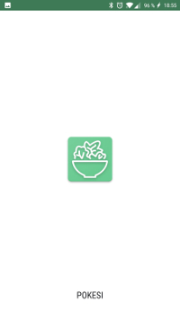
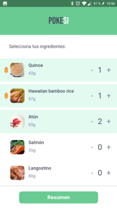
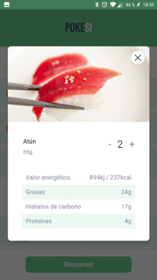
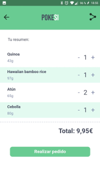

# POKESI, the perfect bowl 🥗
With POKESI you can learn how to convert a web into a PWA (Progressive Web App), how ServiceWorker works or how can we take control of some requests and display custom content. If you want to start with PWAs, maybe you should try this workshop :)

## Branches
* `workshop-complete` contains the final app
* `workshop-start` contains only the app skeleton, ready to start the workshop 
* `master` contains all our changes to the app to be ready for the workshop :)

## Authors

* Pablo Molina ([@p2kmgcl](https://twitter.com/p2kmgcl)) - Frontend Engineer
* Sarai Díaz ([@saray_dg](https://twitter.com/saray_dg)) - Software Engineer

Thank you so much to Emiliano who was helping us with the app design:

* Emiliano Cicero ([@EmilianoGCicero](https://twitter.com/EmilianoGCicero)) - UX Designer
